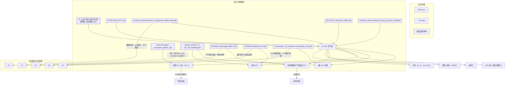

# AL-31F 发动机压气机 —— 详细文献综述

> 编制日期：2026-06 · 本文件夹收录全部相关文献（原文PDF + 双语译文 + 技术报告）
> 所有 [[链接]] 均指向同级目录文件，在 Obsidian 中直接点击即可跳转至全文。

---

## 目录

1. [发动机总览](#一发动机总览)
2. [核心技术报告：压气机可调几何与防喘控制](#二核心技术报告压气机可调几何与防喘控制)
3. [HAL Koraput 一手资料（原文 + 译文）](#三hal-koraput-一手资料原文--译文)
4. [УГАТУ 学报：AL-31F 三维建模（俄文+译文）](#四ugatu-学报al-31f-三维建模俄文译文)
5. [压气机引气与热力学分析（双语译文）](#五压气机引气与热力学分析双语译文)
6. [级间引气与稳定性——ICAS 2020（双语译文）](#六级间引气与稳定性icas-2020双语译文)
7. [CIAM 高载荷 HPC 中间级——ICAS 2010（双语译文）](#七ciam-高载荷-hpc-中间级icas-2010双语译文)
8. [CIAM 离心压气机 CFD 设计——IGTC 2003（双语译文）](#八ciam-离心压气机-cfd-设计igtc-2003双语译文)
9. [跨音压气机转子叶尖间隙与二次流（双语译文）](#九跨音压气机转子叶尖间隙与二次流双语译文)
10. [挤压油膜阻尼器转子动力学（双语译文）](#十挤压油膜阻尼器转子动力学双语译文)
11. [转子-轴承-机匣耦合动力学——陈果2009（双语译文）](#十一转子-轴承-机匣耦合动力学陈果2009双语译文)
12. [NASA 航空推进技术综述（双语译文）](#十二nasa-航空推进技术综述双语译文)
13. [桌面参考扫描件](#十三桌面参考扫描件)
14. [知识图谱](#十四知识图谱)
15. [文献缺口与建议](#十五文献缺口与建议)

---

## 一、发动机总览

| 参数 | 数值 |
|------|------|
| 型号 | AL-31F（留里卡设计局 / NPO Saturn） |
| 类型 | 双转子加力涡扇（低涵道比） |
| 应用 | Su-27 / Su-30 / Su-35 / J-10 / J-11 / J-20 |
| 推力 | 123 kN（AL-31F）/ 137 kN（AL-31FM）/ 145 kN（AL-37FU） |
| 总增压比（OPR） | **23:1** |
| 空气流量 | ~112 kg/s |
| 涵道比 | ~0.57 |
| LPC 级数 | 4 级轴流（π≈3.5:1） |
| HPC 级数 | 9 级轴流（π≈6.6:1） |
| 转子布局 | 双转子，转速独立 |
| 可调几何 | IGV（23片，−30°~0°）+ HPC 前2–3级可调静子 |
| 防喘放气 | 中间机匣外涵旁路（兼涡轮冷却） |

> [[SaturnAL-31-Wikipedia.pdf]]

---

## 二、核心技术报告：压气机可调几何与防喘控制

> [[AL-31压气机可调几何与防喘控制_技术报告.html]]

自生成的完整技术报告（845行 HTML，含 4 幅 SVG 工程原理图），内容覆盖从失稳机理到 AL-31 具体实现的完整逻辑链。以下为详细内容：

### 2.1 轴流压气机失稳机理

**叶栅攻角与失速本质：** 压气机每一级转子叶片本质上是排"机翼"。气流攻角由轴向速度 $C_a$ 与叶片切向速度 $U$ 合成的相对速度方向决定。设计点上攻角最优；当转速下降或流量变化时，速度三角形改变：

- **攻角过大**（低转速、流量偏小）→ 叶背气流分离 → 失速
- **攻角过小甚至负攻角**（高转速、流量偏大）→ 叶盆分离、流通"堵塞"（choke）

**旋转失速 vs 喘振：**

| 现象 | 本质 | 表现 | 危害 |
|------|------|------|------|
| 旋转失速 | 局部失速团沿周向传播，流量周向不均 | 叶片交变激振、效率/增压比下降 | 叶片高周疲劳，可能诱发喘振 |
| 喘振 | 整个压气机轴向流量周期性中断甚至倒流 | 低频强烈"喘息"、推力骤降、熄火 | 结构破坏、烧蚀，必须严格避免 |

**压气机特性图（compressor map）：** 横轴换算流量、纵轴增压比，图上为等换算转速线。喘振边界线（surge line）和工作线（operating line）之间的距离即喘振裕度。变工况会使工作线上移、喘振边界下移，裕度被压缩——这正是可调几何要解决的核心问题。

### 2.2 可调几何防喘原理

**多级匹配问题：** 多级压气机中，空气越往后密度越大、叶片越短。当转速下降时：
- **前面级（含 LPC/风扇）容易失速** → 需要减小其攻角
- **后面级容易堵塞** → 需要在级间放掉一部分流量来"卸压"

**可调静子/导叶（VIGV/VSV）原理：** 把进口导叶和前几级静子做成可绕自身轴线转动。低转速时向"关小"方向偏转（增大预旋、减小轴向通流面积），使进入下游转子的相对气流攻角回到合理范围。本质是**给气流加一个可控的预旋**，把偏离设计点的速度三角形"掰"回接近设计状态。

**级间/涵道放气：** 在压气机中段设放气口，人为增大前面级的通流量、减小后面级的负荷。AL-31 利用双转子结构在 LPC 之后向外涵道旁路。

**双转子结构本身的稳定性贡献：** 两个转子会各自找到平衡转速，**转速比 $n_H/n_L$ 自动调整**，自然缓解前后级的流量失配。这也是 AL-31"能容忍进气道严重畸变、左右发动机可互换"的物理基础。

### 2.3 AL-31 防喘体系具体实现

| 部件 | 级数/数量 | 可调性 | 说明 |
|------|----------|--------|------|
| IGV（LPC 前） | ~23片可动叶片 | 可调，约−30°~0° | 由电传控制自动调节进口流通面积 |
| LPC（风扇） | 4级轴流，π≈3.5:1 | 转子不可调 | 钛合金叶片；后接外涵旁路 |
| HPC | 9级轴流，π≈6.6:1 | 前几级静子可调 | 第1、2（部分资料含第3）级静子可变 |
| 中间机匣 | LPC 与 HPC 之间 | 放气/旁路 | 涵道比≈0.57；中央锥齿轮传动；吊挂点 |

> ⚠ **资料口径差异：** HAL 实习报告称"前3级静子可调"，气动作动筒项目报告记为"第1、2级可调"。建议表述为"前2–3级静子可调"。

### 2.4 控制与调节规律

- **调节参数：** 换算转速 $n/\sqrt{T_1}$（T₁ 为压气机进口总温）
- **规律：** 低换算转速 → 叶片关小（大预旋）；接近设计点 → 打开到设计角；加速过渡态 → 配合放气
- **实现路径：** AL-31FP 由**电传控制**单元自动调节；衍生型（AL-41F1/117）整合进 **FADEC 全权数字控制**

### 2.5 多手段协同

| 手段 | 作用工况 | 对特性图的影响 |
|------|---------|---------------|
| 可调 IGV（−30°~0°） | 全包线，尤其中低转速 | 抬高前级喘振边界、匹配进气 |
| HPC 前级可调静子 | 高压转子变转速 | 扩大 HPC 喘振裕度 |
| 中间机匣放气/旁路 | 起动、慢车、加速过渡 | 降低工作线、解除后级堵塞 |
| 双转子转速自适应 | 全工况 | 自动缓解前后级流量失配 |
| 燃油调节（限制加速供油率） | 加减速过渡态 | 约束工作线上移速度 |

### 2.6 材料工艺

"前钛后镍"的分段选材：

| 部件 | 材料 |
|------|------|
| 可调 IGV | 钛合金（锻造+机加，中空结构供防冰） |
| LPC 叶片 | 钛合金 |
| HPC 第1级 | 钛合金 |
| HPC 第2–9级 | 镍基高温合金 |
| 压气机轮盘 | 钢合金/高速碳化物钢 |
| 迷宫封严盘 | 镍基合金 |

### 2.7 衍生演进

| 型号 | 压气机布局 | 关键演进 |
|------|-----------|---------|
| AL-31F（基本型） | 4风扇+9高压，OPR 23:1 | 可调IGV+HPC前级可调静子+放气 |
| AL-31FP（苏-30MKI） | 同上 | +推力矢量喷管（±14–15°），HAL许可生产 |
| AL-41F1S/117S（苏-35） | 4风扇+9高压 | 风扇直径从905mm增至932mm（≈3%），新高/低压涡轮，独立数字控制 |
| AL-41F1/117（苏-57） | 4风扇+9高压 | 增大风扇，FADEC与飞控耦合，推力矢量 |

---

## 三、HAL Koraput 一手资料（原文 + 译文）

### 3.1 实习研究报告

> **原文PDF**：[[STUDYOFAL31FPENGINEMANUFACTURINGASSEMBLYANDTESTING.pdf]]
> **双语译文**：[[AL-31FP发动机与气动缸故障研究（双语）]]

**作者：** Undavalli Vamsikrishna & Bodramoni Balakrishna（Amity University 航空航天工程系）
**单位：** HAL Koraput 分部（苏-30MKI 发动机制造与总装车间）
**时间：** 2014年5月2日–6月16日（暑期实习）
**来源：** ResearchGate（DOI: 10.13140/RG.2.1.2150.3204）

**内容结构：** 全文含发动机各部件详解（含压气机级数、可调IGV/静子、中间机匣、材料工艺等一手工程描述）、附件系统（航电）、以及 VJN 气动缸故障研究。该报告是上节技术报告中 AL-31F 具体参数的主要来源。

### 3.2 气动作动筒项目报告

> **原文PDF**：[[AL31-FP-engine-pneumatic-cylinder-Project-HAL.pdf]]

**指导：** R.G. Mishra（620装配车间经理）、Shibendu Sen（副经理）
**时间：** 2016年6月

**核心数据：**
- IGV **23 片**可动叶片，角度范围 **−30°~0°**
- HPC 可调静子及其联动机构描述
- 气动作动筒同时用于几何调节与推力矢量喷管（TVC）控制

---

## 四、УГАТУ 学报：AL-31F 三维建模（俄文+译文）

> **原文PDF**：[[Vestnik_UGATU_AL-31F_3D_Modeling.pdf]]
> **双语译文**：[[AL-31F三维建模（UGATU学报）（双语）]]

**作者：** А. Е. Кишалов (Kishalov), В. Д. Липатов (Lipatov)
**单位：** 乌法国立航空技术大学（УГАТУ / UGATU），俄罗斯
**期刊：** Вестник УГАТУ, 2020, Т.24, №4(90), с.48–56
**ISSN：** 1992-6502 (Print), 2225-2789 (Online)
**UDC：** 621.45.01

### 核心内容

基于 Dvigw 仿真系统的**决策支持专家系统（ЭС）** 对 AL-31Ф 主要部件进行结构建模，并在起飞全加力状态（H=0km, M=0）下对比验证。

### 低压压气机（КНД）建模

- 四级轴流，配备可调进口导叶（ВНА）
- 建模假设：恒定平均直径
- 建模结果：
  - **平均相对误差：6.4%**
  - 第 I 级长度最大误差：32%（因实际 ВНА 宽度大于专家系统推荐值）
  - 专家系统建议缩减为3级并增加超声速级
- **材料推荐：** 各级工作叶片均为钛合金方案；前两级推荐 ВТ3-1（与实际一致）

| 级 | 外径 dнар (mm) | 内径 dвнутр (mm) | 叶片数 nрл | 导叶数 nНА | 弦长 bРК (mm) | 推荐材料 (首选) |
|---|--------------|----------------|-----------|-----------|-------------|---------------|
| 1 | 898.5 / 872.0 | 391.5 / 418.1 | 36 | 54 | 56.9 | ВТ3-1 |
| 2 | 851.2 / 823.9 | 438.9 / 466.1 | 48 | 57 | 59.2 | ВТ3-1 |
| 3 | 807.7 / 788.5 | 482.3 / 501.5 | 53 | 53 | 39.5 | ВТ20 |
| 4 | 775.7 / 766.0 | 514.3 / 524.1 | 40 | 80 | 51.1 | ВТ6 |

### 高压压气机（КВД）建模

- 九级轴流，**外径恒定**（Dнар=const）
- 配**可调 ВНА + 前三级可调导叶（НА）**→ 三排可调几何
- 建模结果：
  - **平均相对误差：3.6%**（各级工作轮直径误差不超过2%）
  - 级长度平均误差：4.9%，最大12%
  - 专家系统建议缩减为8级（0超声速级，与实际一致）
  - 叶片+轮盘质量建模误差约5%

### 总体建模精度

| 部件 | 平均相对误差 |
|------|------------|
| **压气机（含LPC+HPC）** | **4.5%** |
| 涡轮 | 2.5% |
| 燃烧室 | 4.47% |
| 加力燃烧室 | 5.68% |
| 喷管 | 11.8% |

> 该论文提供了 AL-31F 压气机核心几何参数（LPC各级内外径、叶片数、弦长）**唯一公开发表的数据源**。

---

## 五、压气机引气与热力学分析（双语译文）

> **双语译文**：[[压气机引气与热力学分析（双语）]]（985行）
> **原文PDF**：[[Archives_Thermodynamics_Compressor_Bleed_Map.pdf]]

**作者：** Paweł Trawiński
**单位：** 华沙工业大学热工研究所
**期刊：** Archives of Thermodynamics, Vol.42(2021), No.4, pp.17–46
**DOI：** 10.24425/ather.2021.138121

### 核心创新

提出一种**完全解析的轴流压气机特性图（compressor map）建模方法**，核心是用**修正椭圆方程**描述各等换算转速线和等效率线，并引入两个关键扩展：

1. **冷却引气抽取（bleed air extraction）** 的数学建模
2. **可调 IGV 角度**的叶片角修正系数（VACF, Vane Angle Correction Factor）

### 方法学细节

**椭圆方程：** 利用可位移、可旋转的椭圆描述等换算转速线：

$$(\frac{x - x_0}{A})^2 + (\frac{y - y_0}{B})^2 = 1$$

其中 $A, B$ 为椭圆半轴，$(x_0, y_0)$ 为椭圆中心。通过引入附加系数 $k_{A1}, k_{A2}, k_{B1}, k_{B2}$ 使椭圆参数依赖于换算转速。

**VACF（叶片角修正因子）：** 将 IGV 角度变化的影响表示为在质量流量和效率维度上的修正系数，从而在特性图上平移等转速线。

**引气模型：** 在压气机中间级引入冷却空气抽取的质量流量分路，并在压气机出口效率计算中考虑引气影响。

### 对 AL-31F 的价值

该方法可直接用于 AL-31F 压气机的特性图构建和变工况分析。由于不需要几何数据，仅需参考特性图或实测数据即可建模。文章还提供了一个完整的与燃气轮机联合工作的轴流压气机数学模型示例。

---

## 六、级间引气与稳定性——ICAS 2020（双语译文）

> **双语译文**：[[ICAS2020_级间引气与稳定性（双语）]]（369行）
> **原文PDF**：[[ICAS2020_Interstage_Bleed_Stability.pdf]]

**作者：** 刘西洋 (Xiwu LIU)、金海良 (Hailiang JIN)、邱道彬 (Daobin QIU)、尹越千 (Yueqian YIN)
**单位：** 中国航发湖南动力机械研究所（AECC Hunan Aviation Powerplant Research Institute）
**会议：** ICAS 2020 — 第32届国际航空科学理事会大会，中国上海

### 研究背景

多级压气机在部分转速下前级攻角过大（近失速）、后级攻角过小（近堵塞），级间引气是缓解这一失配的核心手段。但已有研究多采用简化引气模型，对**真实引气系统结构（引气缝+环形腔+引出管道）** 的数值研究很少。

### 研究对象

4级低压轴流压气机，引气系统位于第2级静子出口/第3级转子入口处，由周向缝→环形集气腔→双轴对称引出管道组成。

### 关键发现

1. **喘振裕度改善：** 引气使40%~80%换算转速下喘振线**显著左移**。当换算转速低于70%时，无引气时工作线已位于喘振线左侧，而引气使工作线回到右侧。
2. **存在最优引气流量：** 在特定换算转速下，为获得更宽工作范围和更高峰值效率，存在一个最优引气流量值；**随换算转速降低，最优引气流量增大**。
3. **效率变化：** 85%~90%高转速下喘振裕度变化可忽略，但**绝热效率因级间匹配改善而提高**。
4. **流动机理：** 引气减小了第1级静子（S1）的正攻角，缓解了后面各级的堵塞——直接对应 AL-31F 中间机匣放气策略。

### 控制规律

IGV 和 S1 在不同换算转速下的控制规律曲线（scheduling curve）在论文中给出，为设计可调几何控制律提供了参考。

---

## 七、CIAM 高载荷 HPC 中间级——ICAS 2010（双语译文）

> **双语译文**：[[ICAS2010_Mileshin_压气机研究（双语）]]（304行）
> **原文PDF**：[[ICAS2010_Mileshin_412.pdf]]

**作者：** V.I. Mileshin, I.K. Orekhov, S.V. Pankov, Eu.I. Stepanov
**单位：** 俄罗斯中央航空发动机研究院（CIAM, Central Institute of Aviation Motors）
**会议：** ICAS 2010 — 第27届国际航空科学理事会

### 研究背景

先进涡扇发动机要求 HPC 级数更少、总压比更高，导致气动负荷大幅增加。三维叶片（弯曲/掠形）是维持高效率和大喘振裕度的关键手段。

### 试验对象

四级高载荷 HPC 的典型中间级原型，设计参数：

| 参数 | 数值 |
|------|------|
| 转子外径 | 576 mm（恒定） |
| 理论功头系数 $\bar{H}_T$ | 0.404 |
| 换算轴向速度系数 $\bar{C}_{1a.cor}$ | 0.516 |
| 换算空气流量 $G_{air.cor}$ | 11.8 g/s |
| 设计绝热效率 $\eta^*_{ad}$ | 0.88 |
| 级增压比 $\pi^*_{stage}$ | 1.52 |
| 叶尖换算圆周速度 $U_{tip.cor}$ | 327 m/s |
| 叶片排 | IGV + 转子(67片) + 静子(104片) |

### 关键发现

1. **"镰刀型"转子叶片：** 安装角轴沿周向弯曲、压力面呈凹形 → **绝热效率显著提高**
2. **弯刀形静子叶片：** 三排导叶弯曲设计，在 $\pi^*_к>5$ 时效率达 $\eta^*_{ad}=0.87$
3. **历史背景：** CIAM 在1980年代末即发现，弯曲静子使效率提高 **1–2%**，且级出口总压脉动周期性分量**降低为原来的一半**
4. **机理认知：** 效率提升并非直接源于二次流减弱，而是**转子性能改善**的间接结果——尽管在对比试验中转子未作改动

### 对 AL-31F 的价值

CIAM 是俄罗斯航空发动机核心研究机构，这项针对高载荷 HPC 级的研究直接指向 AL-31F 9级 HPC 的叶片气动设计。AL-31F 的 HPC 前级弯曲静子方案与本研究同源。

---

## 八、CIAM 离心压气机 CFD 设计——IGTC 2003（双语译文）

> **双语译文**：[[Mileshin_CIAM_IGTC2003_压气机CFD（双语）]]（538行）
> **原文PDF**：[[Mileshin_CIAM_IGTC2003_CFD_Compressor.pdf]]

**作者：** Victor I. Mileshin, Andrew N. Startsev, Igor K. Orekhov
**单位：** CIAM（俄罗斯中央航空发动机研究院）
**会议：** IGTC 2003 Tokyo（国际燃气轮机大会），论文 TS-043

### 设计目标

| 指标 | 目标值 |
|------|--------|
| 总增压比 $\pi^*_c$ | **8:1** |
| 绝热效率 $\eta_{ad}$ | **81–82%** |
| 换算质量流量 $Q$ | 1.5–2.8 kg/s |

### 关键技术

**"双重压缩"激波结构：** 基于 Kantrowitz (1947) "长喉道超声速扩压器"概念，在诱导轮处形成两道弱激波（而非单道强激波），从而实现最小激波损失。CIAM 内部开发的 "3D-IMP-MULTI" N-S 求解器，采用三阶 Godunov 格式 + Baldwin-Lomax 湍流模型。

**验证路径：** 先用6.5:1 增压比试验压气机验证N-S求解器，再应用于8:1设计。

**叶尖泄漏控制：** 双重压缩结构在最小化激波损失的同时，也实现了**压力驱动的叶尖泄漏最小化**，扩展了压气机的稳定工作范围。

### 对 AL-31F 的价值

Mileshin 团队来自 CIAM，其压气机设计方法论直接反映了俄罗斯压气机气动设计的技术路线——可视为 AL-31F 系高压压气机设计的背景参照。

---

## 九、跨音压气机转子叶尖间隙与二次流（双语译文）

> **双语译文**：[[压气机叶尖间隙与二次流（双语）]]（419行）
> **原文PDF**：[[Compressor_Tip_Clearance_Secondary_Flow.pdf]]

**作者：** Lakshya Kumar, Dilipkumar B. Alone, A.M. Pradeep, M.T. Shobhavathy, Satish Kumar S.
**单位：** 印度国家航空实验室（NAL）推进部 + 印度理工学院孟买分校（IIT Bombay）
**期刊：** Defence Science Journal, Vol.74, No.2, March 2024, pp.163–172
**DOI：** 10.14429/dsj.74.19623

### 研究对象

跨音轴流压气机转子，叶尖相对马赫数 **1.15**，转速 **13,250 rpm**，叶片数 **21**，叶尖间隙 **0.55 mm**。

### 方法

60%–100% 设计转速，**稳态与非稳态 RANS**，对比 SST / k-ε / 雷诺应力三种湍流模型。

### 关键发现

1. **SST 湍流模型预测最接近实验数据**
2. **失稳机制：** 主叶尖泄漏涡（primary TLV）+ 次级叶尖泄漏涡（secondary TLV）+ 吸力面叶尖角区分离（suction side tip corner separation） → 近 stall 区域的主要失稳源
3. **激波-泄漏涡交互：** 通道激波与叶尖泄漏流的相互作用贡献约 **30% 的通道总损失**
4. 激波结构随反压（back-pressure）增大而向上游移动，最终在近 stall 点时位于叶片通道前部

### 对 AL-31F 的价值

AL-31F HPC 后级叶片极短（~14mm），叶尖间隙对性能的影响极为显著。该研究的数值方法和物理结论可直接应用于 AL-31F HPC 叶尖流动分析和间隙优化。

---

## 十、挤压油膜阻尼器转子动力学（双语译文）

> **双语译文**：[[挤压油膜阻尼器转子动力学笔记（双语）]]（598行）
> **原文PDF**：[[SFD_Rotor_Dynamics_Notes.pdf]]

**作者：** Dr. Luis San Andrés
**单位：** Texas A&M University
**来源：** Rotordynamics Lecture Notes, No.13 (2010)

### 核心内容

SFD（Squeeze Film Damper）在涡扇发动机中的应用原理：

- **振动抑制：** SFD 为滚动轴承提供黏性阻尼，降低转子对不平衡量的响应振幅
- **失稳抑制：** 帮助抑制压气机转子的亚同步失稳（subsynchronous rotor instability）
- **典型结构：** 非旋转轴颈 + 固定外座圈 + 0.250 mm 级油膜间隙 + 防转销/鼠笼定心弹簧
- **工程挑战：** 空穴效应（cavitation）、空气吸入（air entrainment）等问题会影响 SFD 实际性能

### 对 AL-31F 的价值

AL-31F 压气机转子使用弹性支承 + SFD 的设计，该笔记提供直接的转子动力学理论支撑。

---

## 十一、转子-轴承-机匣耦合动力学——陈果2009（双语译文）

> **双语译文**：[[转子-轴承-机匣耦合动力学（陈果2009）（双语）]]（537行）
> **原文PDF**：[[ChenGuo_Rotor_Bearing_Casing_Dynamics_2009.pdf]]

**作者：** 陈果（CHEN Guo）
**单位：** 南京航空航天大学民航学院
**期刊：** 振动工程学报（J. Vibration Engineering），2009, Vol.22, No.5, pp.538–545

### 模型特点

1. 转子考虑为**等截面自由欧拉梁模型**，运用模态截断法分析
2. 考虑**滚动轴承间隙、非线性赫兹接触力、变柔性（VC）振动**
3. 考虑**弹性支承 + 挤压油膜阻尼器（SFD）效应**
4. 模拟**转子与机匣之间的碰摩故障**
5. 采用数值积分方法获取系统响应

### 对 AL-31F 的价值

为 AL-31F 压气机转子-轴承-机匣系统提供完整的动力学建模方法，尤其在考虑碰摩故障和非线性轴承力时，对分析压气机转子振动故障有直接指导意义。

---

## 十二、NASA 航空推进技术综述（双语译文）

> **双语译文**：[[NASA航空推进（双语）]]（430行）
> **原文PDF**：[[NASA_aeropropulsion_42813208.pdf]]

**作者：** Neal T. Saunders, David N. Bowditch
**单位：** NASA Lewis Research Center
**报告编号：** N92-22511 (1987)

回顾从 Whittle 首台涡喷（1937）到 1980 年代航空推进技术的 50 年发展。作为 AL-31F 压气机技术同时期（1980s）的行业背景参考。

---

## 十三、桌面参考扫描件

以下文件为扫描件（无可提取文字层），提供原始构造图示参考：

| 文件 | 内容说明 |
|------|---------|
| [[Soviet_1980s_AL-31_Theory_of_operation_manual.pdf]] | 苏联1980年代 AL-31 操作理论手册（27MB 高清扫描件） |
| [[Main_General_Drawing_of_early_AL31.pdf]] | AL-31 早期总图（2.6MB 工程图扫描） |
| [[AL31_afterburner_spec_shared_on_a_Chinese_public_website.pdf]] | AL-31 加力燃烧室规格参数 |
| [[AL31f.pdf]] | AL-31F 综合图示（9.1MB） |

---

## 十四、知识图谱

## 十五、文献缺口与建议

| 序号 | 缺口 | 建议检索方向 | 优先级 |
|------|------|------------|--------|
| 1 | AL-31F 压气机**完整的特性图（compressor map）** 公开数据 | 俄文文献（CIAM 技术报告、UMPO 出版物、俄刊《Авиационные двигатели》） | ★★★ |
| 2 | 详细的 **VSV 调节规律曲线（scheduling curve）** | Saturn/NPO 技术手册（受保密限制） | ★★★ |
| 3 | AL-31F **HPC 具体叶型（blade profile）几何** | 逆向工程 / 专利文献 | ★★ |
| 4 | **AL-31F-M3 / 117（苏-57）改进型压气机**对比数据 | 俄文期刊、UMPO 公开资料 | ★★ |
| 5 | AL-31F压气机 **喘振瞬态过程（surge transient）** 实验数据 | NASA 报告、CIAM 试验报告 | ★★ |

---

## 十六、跨学科连接

> 本专题与 [[工程热力学/00-Dashboard/工程热力学 MOC|工程热力学]] 存在以下交叉联系，点击跳转：

### 直接关联章节

| 热力学章节 | 连接点 | 具体内容 |
|-----------|--------|---------|
| [[工程热力学/05-气体流动与压缩/第5章_气体的流动和压缩\|第5章 气体的流动和压缩]] | ↑ **已建立** | §5-3 压气机：AL-31F 三级压缩对比、多级压缩与级间放气 |
| [[工程热力学/06-气体动力循环/第6章_气体动力循环\|第6章 气体动力循环]] | ↑ **已建立** | §6-4 布雷顿循环：AL-31F 涡扇发动机循环分析 |
| [[工程热力学/NN-Practice/工程应用_Practice\|工程应用 Practice]] | ↑ **已新增** | 习题13-14：AL-31F 增压比效率计算、双转子热力学分析 |

### 概念映射

| AL-31F 工程概念 | 对应热力学理论 |
|----------------|--------------|
| OPR 23:1 | 理想布雷顿效率 $η_{Brayton}=1-1/π^{(k-1)/k} ≈ 56\%$ |
| 级间放气 | 多级压缩中间冷却、降低压缩功 |
| 可调 IGV → 调节攻角 | 控制叶栅通道内多变指数 n |
| 双转子转速自适应 | 流量系数 $φ=C_a/U$ 自动匹配 |
| 压气机特性图 (map) | 等转速线、喘振边界线、效率等值线 |
| 旋转失速 → 喘振 | 攻角偏离最优 → 气流分离 → 逆压梯度下的流动不稳定性 |
| 绝热效率 $η_{ad}=0.87$ | 实际压缩过程与等熵压缩的偏离程度 |

---

*本文件夹包含 AL-31F 压气机全部相关文献共 28 个文件。所有 [[链接]] 均为同级目录引用。*
*建议在 Obsidian 中打开本文件夹作为 vault，或将其作为子文件夹加入已有 vault。*
