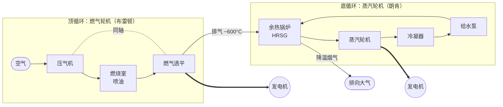

# 第11章 双工质动力循环 —— 精读笔记

> 🧭 ← [[LLM上下文/工程热力学/工程热力学 MOC|工程热力学 MOC]] · [[LLM上下文/工程热力学/Quick Reference|Quick Reference]]

## 目录
- [[#11-1 概述——循环充满度]]
- [[#11-2 工质性质对循环热效率的影响]]
- [[#11-3 汞-水与钾-水双蒸气循环]]
- [[#11-4 燃气-蒸汽联合循环]] ⭐重点
- [[#11-5 注蒸汽燃气轮机装置循环]]
- [[#11-6 压气机喷水燃气轮机装置循环]]
- [[#11-7 湿空气透平装置循环（HAT循环）]]
- [[#速记卡 一句话总结]]

---

## 11-1 概述——循环充满度

一·背景：两种主流动力循环各有短板

  1.燃气轮机装置循环（布雷顿循环）
    （1）最高温度 ~**1300°C**（1573K），排气温度 ~**600°C**
    （2）循环热效率仅 **≈ 30%**
    （3）特征：平均吸热温度高 → 好；但平均放热温度也高 → 差

  2.蒸汽动力循环（朗肯循环）
    （1）最高温度 ~**600°C**（873K），排汽温度 ~**30°C**
    （2）循环热效率 **≈ 40%**
    （3）特征：平均吸热温度不高 → 差；但平均放热温度接近环境温度 → 好

  → 两者各有优势 → 能否取长补短、结合起来？→ 本章主题。

二·循环充满度——本章核心概念

  1. **定义**：循环热效率与相同最高温度 $T_\text{max}$ 和环境温度 $T_0$ 之间卡诺循环热效率的比值。

  2. **公式**：

$$\text{充满度} = \frac{\eta_\text{实际}}{\eta_\text{卡诺}} = \frac{\eta}{1 - T_0/T_\text{max}}$$

  3. **物理解释**：在 T-s 图上，卡诺循环是矩形（最饱满），实际循环是不规则形状。充满度衡量实际循环"填满"卡诺矩形的程度。

  4. **数值对比**（原文计算）：
    （1）燃气轮机：$\eta \approx 0.30$，卡诺效率 $1-293/1573 = 0.814$ → 充满度 **≈ 0.369**
    （2）蒸汽动力：$\eta \approx 0.40$，卡诺效率 $1-293/873 = 0.664$ → 充满度 **≈ 0.602**

  > [!note] 核心理解
  > 物理直觉：蒸汽循环效率更高，不是因为"更接近卡诺"，而是因为放热温度低得多（接近环境温度 → 卡诺上限本身就低、容易接近）。燃气循环的卡诺上限高（高温差大），但实际循环在 T-s 图上远未填满——平均放热温度太高。
  > 数学本质：η = 1 − T_m,放/T_m,吸，决定 η 的是两个**平均温度**的比值，而不是最高温度。充满度 = η/η_c 仅反映"形状饱满度"，不代表绝对效率高低。

  5. **核心结论**：==提高动力循环热效率的根本途径——提高平均吸热温度、降低平均放热温度==。单工质难以兼顾两者 → 双工质循环应运而生。

三·双工质循环的分类思路

  1.**串联型**（两种工质不掺混）：顶循环 + 底循环，通过换热器传递热量
    （1）汞-水 / 钾-水双蒸气循环（§11-3）
    （2）燃气-蒸汽联合循环（§11-4）

  2.**并联型**（两种工质掺混）：燃气与蒸汽/水混合
    （1）注蒸汽燃气轮机循环（§11-5）
    （2）压气机喷水循环（§11-6）
    （3）湿空气透平 HAT 循环（§11-7）

---

## 11-2 工质性质对循环热效率的影响

一·问题的提出

  1.蒸汽动力循环效率高于燃气循环的**根本原因**：具有接近环境温度的**定温放热过程**（饱和区内定压 = 定温）
  2.燃气不处于饱和区 → 只能定压放热，难以定温 → 平均放热温度高
  3.蒸汽的定温吸热（汽化段）温度也不高 → 受限于水的临界温度（$t_c = \mathbf{373.99°C}$，$p_c = \mathbf{22.064\,MPa}$）

二·理想动力工质的七个特性（按重要性排列）

  1.**临界温度远高于材料容许的最高蒸气温度 $T_{s,\max}$**
    （1）目的：在饱和区内实现定温（= 定压）吸热和放热
    （2）→ T-s 图上吸热/放热线接近水平直线，循环更"方"→ 充满度高
    （3）临界温度不够高 → 只能在过热区吸热 → 平均吸热温度降低

  2.**饱和压力适当、气化潜热大**
    （1）对应 $T_{s,\max}$ 的最高饱和压力不要太高（避免高压容器困难）
    （2）气化潜热尽可能大 → 更有效地在高温下定温吸热

  3.**三相点温度低于大气温度**
    （1）防止工质在涡轮机末级膨胀降温至接近大气温度时凝固
    （2）固态颗粒 → 叶片冲蚀

  4.**液体比定压热容尽量小**
    （1）在 T-s 图上：饱和液体线尽量**陡**
    （2）物理意义：预热段吸热量相对气化潜热占比小
    （3）→ 更多热量在最高温度下以定温方式吸收 → 平均吸热温度提高

  5.**饱和蒸气线尽量陡**
    （1）目的：涡轮机后几级蒸气湿度不过大
    （2）湿蒸气中的液滴 → 叶片水蚀 → 效率下降、寿命缩短

  6.**冷凝温度 $T_c$（≈ 环境温度 $T_0$）对应的饱和压力 $p_c$ 不要太低**
    （1）$p_c$ 太低 → 维持冷凝器高真空度困难
    （2）比体积太大 → 末级叶片及排气管道尺寸过大

  7.**化学稳定性好、无毒、不腐蚀金属、来源充足、价格便宜**
    （1）工程可行性条件

  > [!tip] 补充
  > 这七个特性实质上是把"卡诺循环需要两个等温过程"的要求翻译成了工质的物性条件。特性 1-2 保证高温端等温吸热可行；特性 3、5、6 保证低温端等温放热和膨胀过程可行；特性 4 保证循环形状饱满。

三·现实工质的对比

  1.水（H₂O）：低温段好（$p_c$ 不太低），但临界温度 **374°C** 太低 → 无法高温定温吸热
  2.汞（Hg）：临界温度极高 → 高温段定温吸热好；但大气温度下饱和压力极低 → 无法低温工作
  3.钾（K）：类似汞，临界温度高 → 高温段好；大气温度下已凝固

  → **结论**：==目前找不到单一工质同时满足全部七个特性== → 用两种工质分工合作：高温段用汞/钾、低温段用水 → **双蒸气循环**。

---

## 11-3 汞-水与钾-水双蒸气循环

一·基本思想

  1.**顶循环**：高温工质（汞或钾）在高温段工作 → 平均吸热温度高
  2.**底循环**：水蒸气在低温段工作 → 平均放热温度低（接近环境）
  3.顶循环的放热通过**换热器**传递给底循环 → 为水预热和汽化
  4.→ 串联型双工质循环（两种工质不掺混）

二·系统与 T-s 图

  ![[图_钾水双蒸气循环系统.excalidraw]] <!-- 📌 待补图 -->
  > **图注**：钾-水双蒸气循环系统示意图。钾回路：锅炉（吸热）→ 钾蒸气轮机 → 钾-水换热器（放热给水）→ 凝结 → 泵回锅炉。水回路：换热器中预热+汽化 → 过热器 → 水蒸气轮机 → 冷凝器 → 泵回。

  ![[图_钾水双蒸气循环Ts.excalidraw]] <!-- 📌 待补图 -->
  > **图注**：钾-水双蒸气循环 T-s 图。上方为钾的循环（高温区），下方为水的朗肯循环（低温区）。两循环在 T-s 图上竖直排列，钾循环的放热线与水循环的吸热线在换热器中对应。钾的临界温度远高于水 → 钾循环可以"压"在高温区。

三·流量比推导与循环热效率

  1. **流量比 $m$** — 关键设计参数
    （1）定义：钾（汞）蒸气质量流量与水蒸气质量流量之比
    （2）由换热器能量平衡确定（式 11-1）：

$$m = \frac{h_5 - h_4}{h_a - h_b}$$

    其中 $h_a$、$h_b$ 为顶循环工质在换热器进出口焓，$h_4$、$h_5$ 为水侧进出口焓。

  2. **循环净功**（相对于每千克蒸汽，式 11-2）：

$$W = m[(h_a - h_b) - (h_c - h_d)] + [(h_1 - h_2) - (h_3 - h_4)]$$

    第一项为顶循环净功（涡轮功 − 泵功），第二项为底循环净功。

  3. **吸热量**（式 11-3）：

$$Q_1 = m(h_a - h_d) + (h_1 - h_5)$$

  4. **放热量**（式 11-4）：

$$Q_2 = h_2 - h_3$$

    注意：只有底循环向环境放热（平均放热温度很低）。

  5. **热效率推导**（式 11-5）：
    （1）热效率定义：$\eta = 1 - Q_2/Q_1$ ← 循环热效率通用定义
    （2）代入 $Q_1$（式 11-3）和 $Q_2$（式 11-4）← 串联循环的特殊性——$Q_2$ 仅含底循环
    （3）得：

$$\eta = 1 - \frac{Q_2}{Q_1} = 1 - \frac{h_2 - h_3}{m(h_a - h_d) + (h_1 - h_5)}$$

    （4）推论：$Q_2$ 小（底循环近环境放热）、$Q_1$ 大（两循环吸热之和）→ η 高

  > [!note] 核心理解
  > 物理直觉：双蒸气循环 = 把卡诺循环的高温等温段"外包"给汞/钾，低温等温段仍由水负责。两个工质各司其职，合起来逼近卡诺矩形。数学本质：串联循环的 η = 1 − Q₂/Q₁，Q₁ 中包含两个循环的吸热，但 Q₂ 仅有底循环的低温放热 → 放热平均温度接近环境 → 效率大幅提升。

四·例题 11-1 关键数据（汞-水双蒸气循环）

  1.汞蒸气参数：$t_a = \mathbf{515.5°C}$（$p_a = \mathbf{0.981\,MPa}$），$h_a = \mathbf{393.00\,kJ/kg}$
  2.汞凝结压力：$p_b = \mathbf{0.098\,MPa}$（$t_b = \mathbf{249.6°C}$），$h_b = \mathbf{257.85\,kJ/kg}$
  3.水蒸气参数：$p_1 = \mathbf{3.0\,MPa}$，$t_1 = \mathbf{450°C}$，$p_2 = \mathbf{0.004\,MPa}$
  4.计算结果：
    （1）平均放热温度 $T_{m,放} = \mathbf{302.10\,K}$
    （2）平均吸热温度 $T_{m,吸} = \mathbf{727.51\,K}$
    （3）循环热效率 $\eta = \mathbf{58.47\%}$
    （4）相同温限卡诺效率 $\eta_c = \mathbf{62.83\%}$
    （5）==循环充满度 = **93.06%**== → 非常接近卡诺循环！

五·汞与钾的工程比较

  1.**汞**：蒸气有毒 → 对密封要求极高 → 现已不再采用
  2.**钾**：
    （1）高温 **760~982°C** 下饱和压力仅 **0.1~0.533 MPa**
    （2）放热温度 **611~477°C** 下饱和压力 **0.016~0.0026 MPa**
    （3）→ 不存在高压或高真空度技术困难
    （4）==钾-水双蒸气循环有很好的发展前景==

---

## 11-4 燃气-蒸汽联合循环 ⭐

一·为什么比双蒸气循环更现实

  1.双蒸气循环需要两种蒸气轮机 + 高温液态金属换热器 → 技术复杂
  2.**燃气轮机 + 蒸汽轮机**都是成熟技术 → 直接组合即可
  3.燃气轮机排气温度 **~600°C** → 正好用来给余热锅炉产生蒸汽

二·系统构成与 T-s 图


> 串联、工质不掺混：燃气透平排气余热经余热锅炉(HRSG)产生蒸汽，驱动底循环朗肯。
  > **图注**：燃气-蒸汽联合循环系统图。空气 → 压气机 → 燃烧室（喷油）→ 燃气轮机（膨胀做功）→ 余热锅炉（放热给水，水变为蒸汽）→ 排向大气。水侧：水 → 余热锅炉（吸热汽化+过热）→ 蒸汽轮机 → 冷凝器 → 泵回。燃气轮机为顶循环（布雷顿），蒸汽轮机为底循环（朗肯），串联、工质不掺混。

  **T-s 图（联合循环 ASCII 示意）**：

```
T ↑
  |                    ┌────── 3' ───┐    ← 燃气循环 (布雷顿)
  |                   /               \
  |          T₃'≈1500K                \
  |         /                           \
  |    2' /                              \ 4'  排气 ≈800K→ 去余热锅炉放热给水
  |     /                                 \
  |    /                                   \
  | 1'└─────────────────────────────────────┘
  |
  |                     ╔═══ 1 ════╗     ← 蒸汽循环 (朗肯)
  |                    ║     ↑       ║
  |       T₁≈723K     ║   过热      ║
  |                    ║     ↓       ║
  |                    ║  ┌─ 5 ─┐   ║     ← 汽化段 (定温定压)
  |                    ║  │     │   ║
  |                    ║  │     │   ║
  |              4 ────╫──┘     └───╫── 6
  |             预热   ║   水蒸气  ║
  |                    ╚═══════════╝
  |                    /
  |              3 ───/ 2             ← 冷凝 (T₂≈302K, 接近环境)
  |              └──────────────────────→ s
  +————————————————————————————————————————————
```

  > **读图要点**：燃气循环在高温区（T₃' ≈ **1500K**），等压放热线 4'→1' 在余热锅炉中放热给水。水的吸热线 4→5→6→1 与燃气的放热线在 T-s 图上上下对应——燃气温度一路下降，水在 5→6 段定温汽化。**两循环不重叠、竖直串联**。

三·节点温差——设计关键参数

  1. **定义**：余热锅炉中，水开始汽化时（状态 5）的温度 $T_5$ 与燃气在此处的温度 $T_{5'}$ 之差。

$$\Delta T_p = T_{5'} - T_5 \quad \text{(式 11-6)}$$

  2. **性质与物理意义**：
    （1）冷热流体间传热需要温差驱动
    （2）水汽化段是定温过程（$T_5$ 恒定），燃气温度则一路降低
    （3）→ 水开始汽化处的温差是**整个换热器中最小的温差**（传热的"瓶颈"）

  3. **工程约束**：$\Delta T_p$ 一般 **≥ 10K**——保证必要传热强度

  4. **设计逻辑**：
    （1）选定 $\Delta T_p$ → 确定 $T_{5'} = T_5 + \Delta T_p$ → 状态 5 确定
    （2）→ 由能量平衡求出燃气/蒸汽流量比 $m$

四·流量比公式与推导

  1. 由余热锅炉中燃气侧放热 = 水侧吸热（预热+汽化+过热段），得（式 11-7）：

$$m = \frac{h_1 - h_5}{h_{4'} - h_{5'}}$$

    （1）$m$ = 燃气质量流量 / 蒸汽质量流量
    （2）分子：每千克水从状态 5 到状态 1 的吸热量
    （3）分母：每千克燃气从状态 4' 到状态 5' 的放热量

  2. 由 $m$ 确定状态 6（余热锅炉出口燃气状态，式 11-8）：

$$h_6 = h_{4'} - \frac{h_1 - h_5}{m}$$

  > [!note] 核心理解
  > 物理直觉：$m$ 本质上是"多少千克燃气才能把 1 千克水从汽化温度加热到过热温度"——燃气量由传热需求决定，不是任意选的。节点温差越小 → 换热越充分 → 但需要更大换热面积。数学本质：$m$ 由换热器能量平衡式（一阶方程）唯一确定——燃气侧焓降 = (1/m)×水侧焓升。

五·联合循环热效率——完整推导

  1. **循环净功**（针对每千克蒸汽，式 11-9）：

$$W = m[(h_{3'} - h_{4'}) - (h_{2'} - h_{1'})] + [(h_1 - h_2) - (h_4 - h_3)]$$

    （1）第一项 $m[(h_{3'} - h_{4'}) - (h_{2'} - h_{1'})]$：燃气轮机功 − 压气机耗功 = 燃气循环净功 × $m$
    （2）第二项 $[(h_1 - h_2) - (h_4 - h_3)]$：蒸汽轮机功 − 水泵耗功 = 蒸汽循环净功

  2. **吸热量**（仅燃烧室，式 11-10）：
    （1）燃气循环在燃烧室中从外界吸热
    （2）蒸汽循环的"吸热"来自余热回收，不算外界输入

$$Q_1 = m(h_{3'} - h_{2'})$$

  3. **放热量**（燃气排气 + 蒸汽冷凝，式 11-11）：

$$Q_2 = m(h_6 - h_{1'}) + (h_2 - h_3)$$

    （1）第一项 $m(h_6 - h_{1'})$：燃气排气携带的废热
    （2）第二项 $(h_2 - h_3)$：蒸汽在冷凝器中的放热

  4. **热效率**（式 11-12）：
    （1）热效率定义：$\eta = W/Q_1$ ← 净功 / 外界输入热
    （2）等价形式：$\eta = 1 - Q_2/Q_1$ ← 能量守恒
    （3）代入式 11-10 和 11-11：

$$\eta = \frac{W}{Q_1} = 1 - \frac{Q_2}{Q_1} = 1 - \frac{m(h_6 - h_{1'}) + (h_2 - h_3)}{m(h_{3'} - h_{2'})}$$

    （4）关键洞察：$Q_1$ 不含蒸汽循环吸热（来自余热回收），$W$ 含两个循环的净功 → ==效率"凭空"提升==

  > [!note] 核心理解
  > 物理直觉：联合循环的巧妙之处——燃气的"废热"在蒸汽循环里变成了"有用热"。从外界吸热只有燃烧室那一段（Q₁），但做功却是两个循环的功之和。燃气排气的余热不是扔掉，而是"转手"给蒸汽循环。数学本质：η = 1 − Q₂/Q₁，Q₁ 不含蒸汽吸热（因为来自余热回收），而 W 含两个循环的净功 → 分子增大、分母不变 → η 高于任一单独循环。==这就是"1+1>2"的热力学原理==。

六·例题 11-2 关键数据

  1.燃气参数：$T_{1'} = \mathbf{295\,K}$，$p_{1'} = p_4 = \mathbf{0.1\,MPa}$，$T_{3'} = \mathbf{1500\,K}$，$p_2 = p_3 = \mathbf{1.2\,MPa}$
  2.蒸汽参数：$p_1 = \mathbf{5\,MPa}$，$t_1 = \mathbf{450°C}$，$p_2 = \mathbf{0.004\,MPa}$
  3.节点温差：$\Delta T_p = \mathbf{10\,K}$
  4.计算结果：
    （1）流量比 $m = \mathbf{7.680}$（每千克蒸汽需 **7.68 千克**燃气）
    （2）排气温度 $T_6 = \mathbf{416.72\,K}$（**143.57°C**）
    （3）净功 $W = \mathbf{5029.77\,kJ/kg}$（按每千克蒸汽计）
    （4）吸热量 $Q_1 = \mathbf{7952.03\,kJ/kg}$
    （5）放热量 $Q_2 = \mathbf{2922.27\,kJ/kg}$
    （6）==联合循环理论热效率 $\eta = \mathbf{63.25\%}$==
  5.对比：单纯燃气轮机约 30%，单纯蒸汽轮机约 40% → ==联合循环效率大幅超越各单独循环==

七·工程现状

  1.燃气轮机和蒸汽轮机技术均成熟 → 实现联合循环无技术障碍
  2.目前联合循环**净发电效率可达 50% 以上**
  3.天然气联合循环电厂（NGCC）已是主流高效发电方式

---

## 11-5 注蒸汽燃气轮机装置循环

一·与前节联合循环的区别

  1.§11-4：串联型——燃气和蒸汽各有自己的轮机，工质不掺混
  2.§11-5：**并联型**——蒸汽直接注入燃气流，混合后**一同进入同一台涡轮机**膨胀做功

二·系统流程

  ![[图_注蒸汽燃气轮机系统.excalidraw]] <!-- 📌 待补图 -->
  > **图注**：注蒸汽燃气轮机装置系统图。空气 → 压气机 → 燃烧室 → 高温燃气 + 注入蒸汽混合 → 涡轮机（混合工质膨胀做功）→ 余热锅炉（水吸热变蒸汽、废气降温）→ 排入大气。水在余热锅炉中吸热变蒸汽后注入燃烧室出口的高温燃气中。

  1.关键特征：不需要单独的蒸汽轮机 → 系统简化
  2.代价：消耗大量处理过的**软水**（蒸汽随废气排入大气）

三·注蒸汽比 $D$

  1. **定义**：每千克燃气的注蒸汽量（kg 蒸汽/kg 燃气）

  2. 混合过程能量平衡（式 11-13）：

$$h_3 - h_{3'} = D(h_v - h_w)$$

    （1）$h_{3'}$：燃烧室出口燃气焓
    （2）$h_3$：混合后湿燃气焓
    （3）$h_v$：注入蒸汽焓；$h_w$：水的焓

  3. 分压力计算（混合后燃气总压力 = $p_3$，式 11-14~11-16）：

$$x_g = \frac{1}{1 + D \cdot M_g/M_v}, \quad x_v = \frac{D \cdot M_g/M_v}{1 + D \cdot M_g/M_v}$$

    （1）$M_g$、$M_v$：燃气和蒸汽的摩尔质量
    （2）燃气分压 $p_g = p_3 x_g$；蒸汽分压 $p_v = p_3 x_v$

四·膨胀过程特点

  1.燃气和蒸汽混合后一同膨胀，但**定熵指数不同**（$k_g \neq k_v$）
  2.→ 若分开各自定熵膨胀到相同背压，终温不同
  3.→ 但实际混合在一起，温度始终同步下降
  4.近似处理：用**湿燃气平均定熵指数**（式 11-17）：

$$k_m = x_g k_g + x_v k_v$$

  5.膨胀终温（式 11-18）：

$$T_5 = T_4 \left( \frac{p_5}{p_4} \right)^{(k_m-1)/k_m}$$

五·循环热效率

  1.净功（式 11-20）：$W = [(h_4-h_5) + D(h_v-h_{v,5})] - (h_2-h_1) - D(h_w-h_{w'})$
  2.吸热量（式 11-21）：$Q_1 = h_3 - h_{2'}$
  3.放热量（式 11-22）：$Q_2 = (h_6-h_1) + D(h_{v,6}-h_w)$
  4.热效率（式 11-23）：$\eta = 1 - Q_2/Q_1$

六·优缺点

  1.**优点**：
    （1）不需要单独的蒸汽轮机 → 结构简化、投资降低
    （2）涡轮机流量增大 → 功率增大（压气机耗功不变）→ 净输出增加
    （3）循环热效率有所提高

  2.**缺点**：
    （1）消耗大量**软化处理水**（一次性通过，随排气散失）
    （2）→ 如何回收水形成闭式循环 → 待研究

---

## 11-6 压气机喷水燃气轮机装置循环

一·与 §11-5 的区别

  1.§11-5：蒸汽注入**燃气**（燃烧室出口）
  2.§11-6：水注入**空气**（压气机进口或压缩过程中）
  3.→ 同属并联型（燃气+水/蒸汽掺混），但注入位置不同

二·喷水降温原理

  1.水雾化后与进入压气机的空气混合 → 水珠蒸发吸热
  2.→ 压缩过程气体**温升减小** → 压气机耗功显著减少
  3.==核心收益：减少压气机耗功 → 净输出增加==

三·喷水率的极限

  1.存在最大喷水率 $D_{\max}$——对应压缩终点达到饱和状态
  2.超过此极限 → 水珠不能在压气机中完全蒸发 → 进入燃烧室 → 降低循环效率
  3.即使极限以内，若雾化不好（水滴直径不够小），也可能有未蒸发水滴

  > [!warning] 关键误区
  > 不能指望喷水蒸发实现"定温压缩"。因为水滴蒸发依赖温度不断升高。若真的定温压缩（如从 0.1MPa→0.2MPa），空气中原有的水蒸气都会因相对湿度达到 100% 而凝结——怎么还能期望喷进去的水蒸发？==喷水降温 ≠ 定温压缩==。通过外部冷却理论上可接近定温压缩，但喷水蒸发做不到。

四·系统流程

  ![[图_压气机喷水循环系统.excalidraw]] <!-- 📌 待补图 -->
  > **图注**：压气机喷水循环（入口喷水）系统图。水 → 水泵加压 → 喷嘴雾化 → 与空气混合进入压气机 → 湿空气压缩（水珠逐步蒸发）→ 回热器（回收涡轮排气余热）→ 燃烧室 → 湿燃气 → 涡轮机 → 回热器（放热）→ 排入大气。水蒸气最终凝结或散失。

  ![[图_压气机喷水循环Ts.excalidraw]] <!-- 📌 待补图 -->
  > **图注**：T-s 图。过程 01→1：喷水混合降温；1→2：湿压缩（温升小于干压缩 1→2'）；2→3：回热；3→4：燃烧加热；4→5：膨胀；5→6：回热放热；6→0：排气。注意与纯燃气循环（虚线 1→2'→3'→4'）的对比——压缩线更陡（更接近等温）。

五·能量方程与热效率

  1.喷水混合（式 11-24）：$h_1 + D h_w = h_{1'} + (D+d_0)h_{v,1}$
  2.压气机熵方程（式 11-25）：湿空气压缩过程的熵平衡
  3.压气机耗功（式 11-26）：$W_c = (h_2-h_1) + (D+d_0)(h_{v,2}-h_{v,1})$
  4.回热器能量平衡（式 11-27）
  5.燃烧室吸热（式 11-28）：$Q_1 = (h_4-h_3) + (D+d_0)(h_{v,4}-h_{v,3})$
  6.涡轮机功（式 11-29）：$W_t = (h_4-h_5) + (D+d_0)(h_{v,4}-h_{v,5})$
  7.热效率（式 11-31）：$\eta = 1 - Q_2/Q_1$

六·优缺点

  1.**优点**：压气机耗功显著降低 → 净功率和效率提升；系统较简单
  2.**缺点**：消耗软水；喷水雾化要求高；极限喷水率限制

---

## 11-7 湿空气透平装置循环（HAT循环）

一·HAT 循环概述

  1.**HAT** = Humid Air Turbine（湿空气透平）
  2.属并联型双工质循环（空气+蒸汽掺混）
  3.==特色：通过饱和器同时实现空气的加热和湿化==
  4.余热回收充分 → 循环热效率较高

二·系统流程

  **空气/燃气侧**：
```
空气 → 低压压气机 → 中冷器(冷却) → 高压压气机 → 后冷器(冷却)
     → 饱和器(升温+湿化) → 回热器(预热) → 燃烧室(升温至T_max)
     → 湿空气透平(膨胀做功) → 回热器(放热) → 热水器(放热) → 排入大气
```

  **水侧**：
```
补充水 → 水泵1 → 与循环水混合
饱和器底部热水 → 水泵2 → 分流：
  ├→ 中冷器 + 后冷器(吸收压缩空气余热)
  └→ 热水器(吸收排气余热)
各路热水汇集 → 饱和器顶部喷淋 → 与压缩空气逆流接触
  → 部分蒸发进入空气 → 随湿空气经历燃烧+膨胀+冷却 → 排入大气
```

  ![[图_HAT循环系统.excalidraw]] <!-- 📌 待补图 -->
  > **图注**：HAT 循环系统图。含低压/高压压气机、中冷器、后冷器、饱和器、回热器、燃烧室、湿空气透平、热水器、两台水泵。注意饱和器是关键部件——既是空气的加热器+湿化器，也是热水的冷却器+蒸发器。

三·饱和器——HAT 循环的核心

  1.**功能**：压缩空气（自下而上）+ 热水（自上而下喷淋）→ 逆流直接接触
    （1）→ 空气被**加热 + 加湿**（含湿量增大）
    （2）→ 热水被**冷却 + 部分蒸发**
  2.→ 同时完成传热和传质
  3.==饱和器实现了低温余热的"品位提升"——用低温热水加热加湿压缩空气，使空气在燃烧前已携带了大量水蒸气（和水蒸气的焓）==

四·能量平衡与参数关联

  1.各特性点参数相互关联，不可随意给定
  2.主要**可独立选择**的变量：
    （1）压气机增压比
    （2）湿燃气最高温度
    （3）含湿量 $D$

  3.其余参数由各换热器能量平衡式确定：
    （1）中冷器+后冷器（式 11-33）：$(h_{2a}-h_{1c}) + (h_{2}-h_{1c}) = (B+D)(h_{1b}-h_{1a})$
    （2）热水器（式 11-34）：$(h_8-h_9) + D(h_{v,8}-h_{v,9}) = B'(h_{1b}-h_{1a})$
    （3）饱和器（式 11-35）：$h_4-h_3 = (B+D)h_{1a} + Bh_{1b} - Dh_w - (B+B')h_{1c}$
    （4）回热器（式 11-36）：$(h_5-h_4) + D(h_{v,5}-h_{v,4}) = (h_7-h_8) + D(h_{v,7}-h_{v,8})$

五·热效率公式

  1.吸热量（式 11-37）：$Q_1 = (h_6-h_5) + D(h_{v,6}-h_{v,5})$
  2.放热量（式 11-38）：$Q_2 = (h_9-h_1) + D(h_{v,9}-h_w)$
  3.净功（式 11-39）：$W = [(h_6-h_7)+D(h_{v,6}-h_{v,7})] - [(h_2-h_1)+(h_{2a}-h_{1c})] - D w_{p1} - (B+B')w_{p2}$
  4.热效率（式 11-40）：$\eta = 1 - Q_2/Q_1$

六·HAT 循环的优势

  1.**余热回收充分**：中冷器（回收压缩热）+ 后冷器 + 热水器（回收排气余热）+ 回热器（回收高温排气余热）→ 多级梯级回收
  2.**饱和器提高品位**：低温热水中的热量通过加湿转移到压缩空气中 → 进入燃烧室前已含大量水蒸气 → 减少燃烧室燃料消耗
  3.==循环热效率较高==
  4.需要持续补充软水

---

## 速记卡 / 一句话总结

- **循环充满度** = 实际效率 ÷ 同温限卡诺效率。汞-水双蒸气循环充满度可达 **93.06%**。
- 提高循环热效率的根本途径：==提高平均吸热温度、降低平均放热温度==——单工质难两全 → 双工质分工。
- 理想动力工质七个特性：临界温度高、饱和压力适当、三相点低于大气温、液体比热小、饱和蒸气线陡、冷凝压力不太低、化学稳定无毒。
- **串联型**双工质（不掺混）：汞-水/钾-水双蒸气、燃气-蒸汽联合循环；**并联型**（掺混）：注蒸汽、压气机喷水、HAT。
- 钾-水双蒸气循环：高温段 **760~982°C** 饱和压力仅 **0.1~0.533 MPa**，有发展前景。汞有毒已弃用。
- **节点温差** $\Delta T_p$：余热锅炉中水开始汽化处与燃气的最小温差，一般 **≥ 10K**。是联合循环设计的关键约束。
- 燃气-蒸汽联合循环：顶循环（布雷顿）+ 底循环（朗肯）。燃气排气余热 → 蒸汽循环吸热 —— 从外界吸热只有燃烧室，做功是两个循环之和 → =="1+1>2"==。
- 联合循环理论热效率：例题 11-2 得 **63.25%**（燃气初温 **1500K**）；当前实际**净发电效率可达 50% 以上**。
- 注蒸汽循环优缺点：省了蒸汽轮机、增了涡轮流量和净功；但消耗软水，需研究闭式水回收。
- 压气机喷水：==喷水蒸发降温 ≠ 定温压缩==！水滴蒸发依赖温升，定温压缩连原水分都会凝结。极限喷水率受饱和状态限制。
- HAT 循环核心：饱和器——低温热水→加湿空气→"品位提升"→减少燃料消耗。余热梯级回收最充分。
